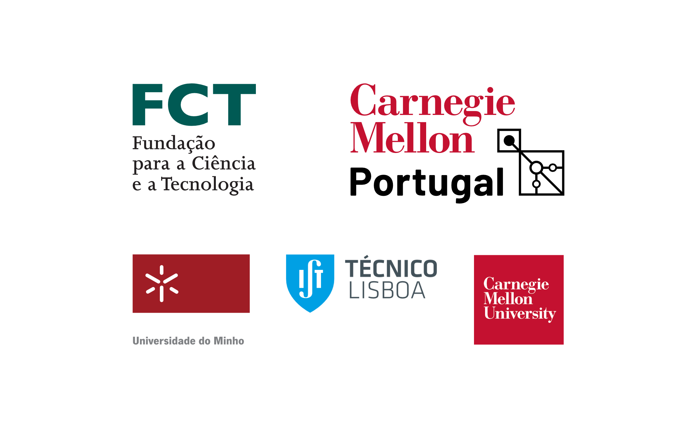

# PROMETHEUS - PocketQube Framework Designed for Research and Educational Access to Space

## Project Summary

The PROMETHEUS project aims at providing easy access to space for the research and education (R&E) community. Learning or researching about space can be more fruitful via hands-on projects. However, Space can seem like a pitfall environment with high risks and therefore high costs to develop projects at the student level. This barrier is critical and hinders R&E opportunities given the lack of experience in this environment. The team has identified that there is no current tool that enables easy and low-cost access to such space experiences of learning or manufacturing a simple satellite device. Looking into Portugal’s Space 2030 national strategy, where we witnessed the creation of the Portuguese Space Agency and other related entities, the growing educational programs offered in Aerospace Engineering and the increasing interest of young students and researchers in this field, there is here an opportunity and a need to provide key tools to generate human critical mass.

The PROMETHEUS project aims at being a contributor for this momentum, by serving as an open-source PocketQube platform.

A PocketQube is a small satellite in a 5 cm cube form factor, an ideal size for R&E. The platform here proposed is based on the PyCubed system (an open-source, radiation tested CubeSat avionics platform that integrates power, computing, communication, and attitude determination and control functionality into a single low-cost PC104-compatible module programmable entirely in Python), previously developed by the CMU team. This means that the entire system is widely available, based on commercial-off-the-shelf components and open-source hardware and software. From the foundation, the proposed platform has all the minimum required conditions to be easily integrated as a tool that facilitates hands-on activities and access to space.
But the PROMETHEUS goes beyond that and shares the entire pipeline for the satellite deployment as it will be licensed, certified, and launched. These steps are critical as, although there are a few design frameworks for PocketQubes available, there is a lack of information about the suitability of such designs to sustain the launch process. Moreover, from the licensing process, and considering that it needs to be performed through the competent national authorities, best-practice guidelines documentation is lacking among the community and if one intends to provide such a tool, it is important to share experiences and hurdles in this process.

**PROMETHEUS aims at giving access to space for everyone.

## Expected Outputs

PROMETHEUS’s main objective is to provide a PocketQube platform that is tested and validated in space, and to make it openly available for everyone to replicate and customize. To accomplish such a goal, the following milestones/outputs need to be reached:

1. Tune the PyCubed platform for the ProcketQube form factor (PROMETHEUS blueprints).
2. Build the PROMETHEUS in different locations and by different people, based on the provided blueprints (replication validation).
3. License and certify the PROMETHEUS (authorization documentation).
4. Launch and validate
5. Share the knowledge (disseminate PROMETHEUS)

If all milestones are successfully accomplished, PROMETHEUS will be the first Portuguese PocketQube in space, as a result of a joint endeavour between Portuguese and CMU researchers, and hopefully will open the road for other national and international groups to do the same.

## Aknowledgment

The project "PROMETHEUS - PocketQube Framework Designed for Research and Educational Access to Space" (ref. CMU/TIC/0017/2021) is supported by [Portuguese Foundation for Science and Technolgy](https://www.fct.pt/index.phtml.en) under the International Partnership [CMU Portugal Program](https://www.cmuportugal.org), in a consortium between [University of Minho](https://www.uminho.pt/EN/Pages/default.aspx) (PT), [Instituto Superior Técnico](https://tecnico.ulisboa.pt/en/) (PT) and [Carnegie Mellon University](https://www.cmu.edu) (USA).

